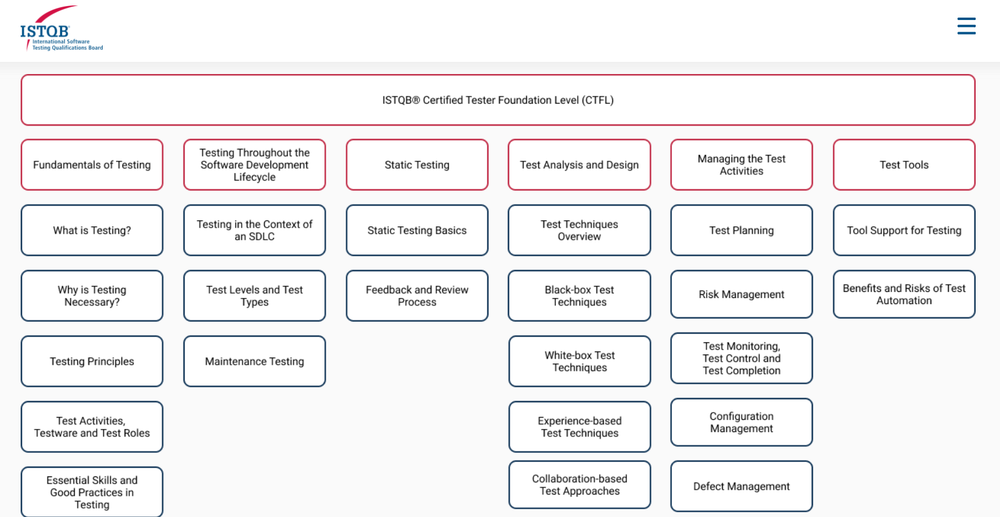

# QA, ISTQB® Certified Tester Foundation Level (CTFL) 

 

  
    <strong>
    <h3 align="center" >ISTQB® Certified Tester Foundation Level (CTFL) </h3>
  </strong>
  

## Automation Tools 

  

## Links Ref
- https://www.udemy.com/course/introduction-to-software-testing-or-software-qa/learn/lecture/28166116#overview
- https://www.freecodecamp.org/learn/quality-assurance/
- automation:
https://selenium-python.readthedocs.io/

## Topics

-   Fundamentals of Testing
-   Agile with Atlassian Jira
-   test case
- Different types of testing at uTest
- How to be a high quality tester
- How to accept or decline a test cycle
- How to find a bug and submit an issue report
- How to claim a testing slot
- How to complete a test case
- How to capture screenshots and videos
- How to record computer and device logs
- How to communicate with the community and Test Team Lead in chat
-   
-   
-   

## Websites Links use for testing

-   testLink
-   testRail (not free)
-   guru99.com
- utest.com  -   https://www.utest.com/academy/tracks/1/courses/what-is-software-testing 
- supersqa.com
- https://www.youtube.com/watch?v=Xjv1sY630Uc&list=PLzMcBGfZo4-n40rB1XaJ0ak1bemvlqumQ

